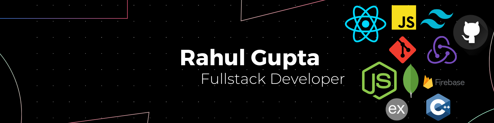

<h1 align='center'>
  Hi there  I'm Rahul Gupta
</h1>

<h3 align='center'>
  A passionate fullstack developer from India 
</h3>

  

 

 

🔭 I’m currently working on **[Employee Management Wep App Project](https://morningstarz.web.app/)** 

🏫 I’m currently learning **HTML, CSS, JavaScript, Typescript, React js, Next.js, NodeJS, Express, MongoDB, Git**

👯 I’m looking to collaborate on **Open source Project.**

💬 Ask me about **Fullstack Development.**

🚀 Love to talk about **Research and Innovation!**

📫 How to reach me **rahul916g@gmail.com**

📄 Know about my experiences at my **[LinkedIn Profile](https://www.linkedin.com/in/rahull-gupta/)**

## 🔗 Let's Connect:

## ⚙ Languages and Tools:

## GitHub Stats

  
  

  

## 🏆 Trophies:

